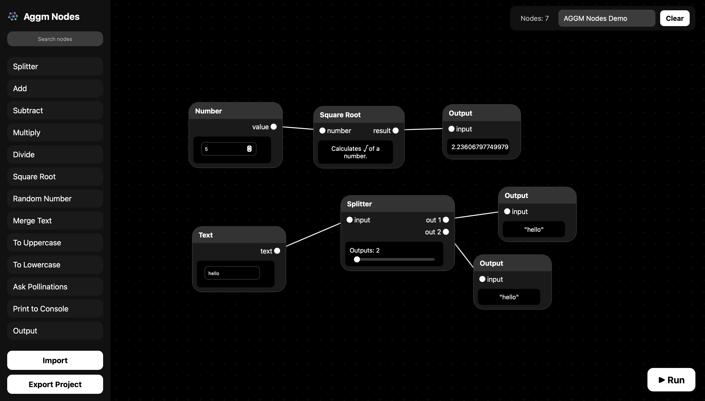

# Aggm Nodes 
## 2.0

Aggm Nodes is a node based IDE app created by Adolfo GM that allows users to visually create scripts using a node-based interface.

Version 2.0 introduces a more intuitive, modern, and user-centric design, making it much easier to create node arrangements and powerful scripts.

## Features

- Connect nodes to form workflows
- Save and load workflows
- Export to Python code or JavaScript code
- Support to pan and zoom on the workspace
- More nodes

## License

MIT License

